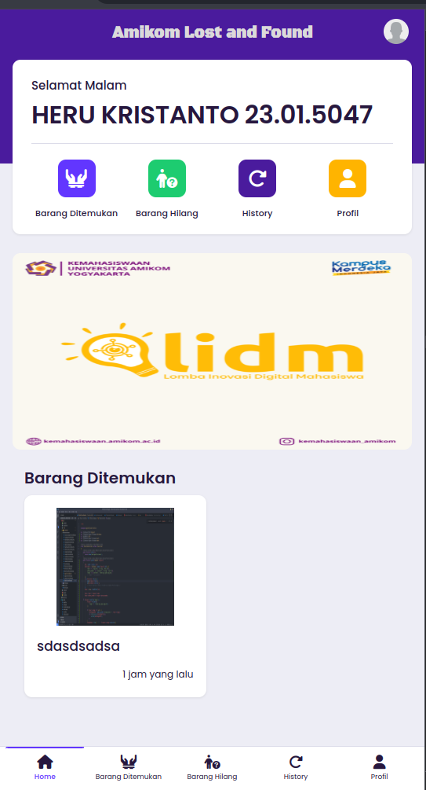

# {Amikom Lost And Found}

## Screenshot


## Tema
Inovation

## Deskripsi dan Latar Belakang
Amikom Lost and Found adalah sebuah platform digital yang dirancang untuk membantu warga amikom dalam mencari dan mengembalikan barang yang hilang. Aplikasi ini memungkinkan warga amikom untuk melaporkan barang yang hilang atau menemukan barang yang tidak diketahui pemiliknya dengan cepat dan efisien. warga amikom dapat menggunakan aplikasi ini dengan mudah melalui perangkat seluler mereka untuk melakukan pencarian atau melaporkan temuan.

Amikom Lost and Found menggunakan Laravel sebagai framework utama untuk pengembangan aplikasi ini. Keputusan ini diambil karena Laravel menyediakan banyak fitur bawaan yang kuat, seperti autentikasi pengguna, ORM yang kuat melalui Eloquent, sistem routing yang fleksibel, dan dukungan yang kuat untuk pengujian. Penggunaan Laravel memungkinkan kami untuk membangun aplikasi yang stabil dan dapat diperluas dengan cepat, sesuai dengan kebutuhan komunitas Amikom dalam mengelola barang hilang dan temuan.

Amikom Lost and Found juga menggunakan Bootstrap4 karena banyak menyidiakan component siap pakai yang responsif dan desain yang modern,dokumentasi dari Bootstrap4 juga sangat mudah untuk di pahami

## Fitur
### Employee / Student
- Login (Done)
- Add Barang Hilang & Menemukan Barang  (Done)
- Edit Postingan Barang Hilang & Postingan Menemukan Barang (sesuai user yang login) (Done)
- Hapus Postingan Barang Hilang & Postingan Menemukan Barang (sesuai user yang login) (Done)
- Lihat All Barang Hilang & All Barang Ditemmukan (Done)
- Edit Profile (Done)
- Prediksi Masa Depan (Belum Done) 
### Admin
- Login (Done)
- Lihat Total User, Barang Hilang & Barang Ditemukan (Done)
- Lihat, Hapus & Edit Employee (Done)
- Lihat & Hapus Student (Done)
- CRUD Category (Done)
- CRUD Announcement (Done)
- Lihat & Hapus Barang Hilang (Done)
- Lihat & Hapus Barang Ditemukan  (Done)
- CRUD Get-Started (Done)
- Edit Profile (Done)

## Teknologi / Tools Yang Digunakan
  ### Frontend : 
- Bootstrap 4
- Sweatalert 2

### Backend : 
- Laravel 11

### Tools
- VsCode
- Xampp


## Cara Run Project
```bash
  git clone https://github.com/NicoIzumi30/amikom-lost-and-found.git
```
```bash
  cd amikom-lost-and-found
```

```bash
  composer install
```
```bash
  cp .env.example .env
```
```bash
  php artisan key:generate
```
```bash
  php artisan migrate
```
```bash
  php artisan db:seed UserSeeder
```
```bash
  php artisan serve
```
